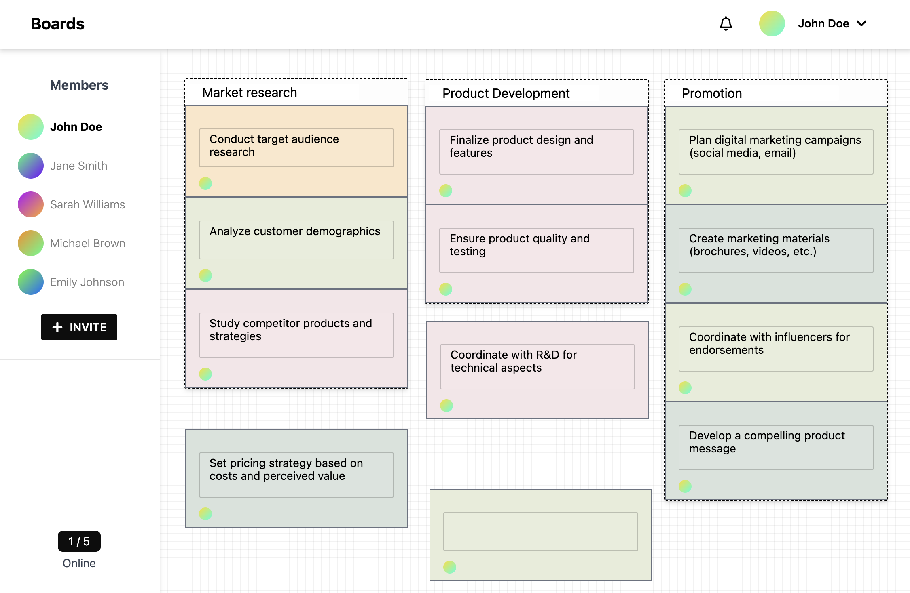
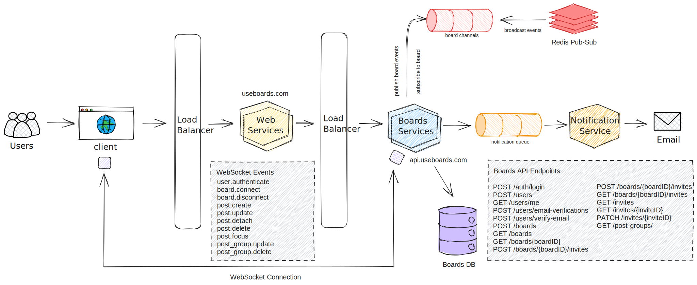

## Boards
Boards is a live collaboration tool for creating and organizing notes on a digital canvas. Boards is a demo project showcasing event-driven microservices written in Golang and a real-time, interactive UI built with Next.js.



## Technology Stack
#### Frontend
- Next.js 13
- Tailwind CSS
- React Drag and Drop
#### Backend
- Chi Router
- Gorilla WebSockets
- RabbitMQ
- Redis PubSub
#### Storage / DB
- PostgreSQL
- sqlc
- pgx
- Golang Migrate v4
#### Infrastructure / Cloud
- Docker
- Kubernetes
- AWS EKS & EC2

## Architecture Overview


## Services

No. | Service | URI
--- | --- | ---
1 | backend-core | [http://localhost:8080](http://localhost:8080)
2 | backend-notification | [http://localhost:8082](http://localhost:8082)
3 | web | [http://localhost:3000](http://localhost:3000)
4 | docs | [http://localhost:8081](http://localhost:8081)

## Relevant Blog Posts
- [WebSockets Client and Hub Architecture](https://medium.com/@wu.victor.95/building-a-go-websocket-for-a-live-collaboration-tool-pt-1-f7e5374b1f47)
- [Implementing Go WebSockets using TDD](https://medium.com/@wu.victor.95/building-a-go-websocket-for-a-live-collaboration-tool-pt-2-5728cd6ec801)
- [Implementing User Authentication Event](https://medium.com/@wu.victor.95/building-a-go-websocket-for-a-live-collaboration-tool-pt-3-b9a6b23f7fef)
- [Hashing Passwords and Authenticating Users](https://medium.com/@wu.victor.95/hashing-passwords-and-authenticating-users-with-bcrypt-dc2fdd978568)

## Project Setup

Before proceeding with the project setup, please ensure that you have [Docker](https://www.docker.com/) installed on your machine. 

```bash
git clone https://github.com/Wave-95/boards.git

cd boards

docker-compose up
```

This will start up the frontend (port 3000), backend (8080), and postgres database (5432) on your local machine. Database migrations should automatically run when the backend service is containerized during the compose step. If you would like test data to start, use `make testdata`. 

## Development

The `docker-compose.yml` file loads in env vars for the server and frontend containers in their respective `.env` files. Depending on the `ENV` env varaible, the containers will either boot up in development or production mode. The backend uses [air](https://github.com/cosmtrek/air) and the frontend uses `next dev`. 

## Database Migrations

Database migrations are run using [`golang-migrate`](https://github.com/golang-migrate/migrate/tree/master/cmd/migrate). The `golang-migrate` dependency should already be available in the backend container. You can either run migrations manually via an interactive shell or use the `make` commands:

```bash
make migrate-up

make migrate-down

make testdata

make migrate-create
```
